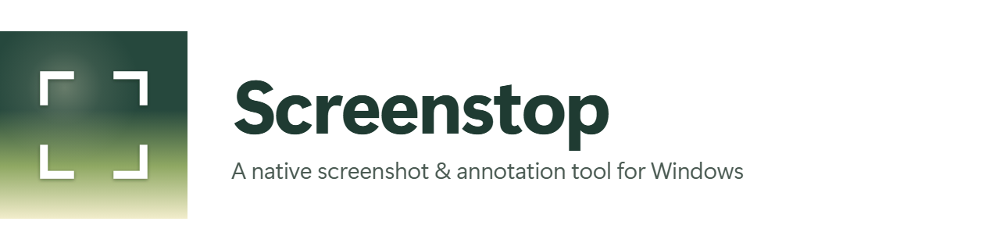

<p align="center">
  <picture>
    <source media="(prefers-color-scheme: dark)" srcset="assets/brand/header-dark.png">
    
  </picture>
</p>

<p align="center">
  <a href="#install">Download</a> ·
  <a href="#features">Features</</a> ·
  <a href="#default-shortcuts">Shortcuts</a> ·
  <a href="#building-from-source">Build it yourself</a>
</p>

<p align="center">
  
  
  
  <a href="https://github.com/ahmrafi22/Screendrop-Windows/releases/latest"></a>
  <a href="https://github.com/ahmrafi22/Screendrop-Windows/commits/main"></a>
</p>

---

## Preview

<p align="center"><sub>Region capture &rarr; annotate &rarr; mockup &rarr; export, end to end.</sub></p>

---

## What it is

**Screenstop** is a native Windows screenshot tool built for people who take a lot of
screenshots. Press a hotkey, drag out a region, mark it up, drop it on a device
frame, and export a PNG — without a round trip to a browser tab.

It runs in the tray. There is no main window, no dock, no account, and no
network call. Screenshots are staged to a temp folder and go exactly where you
tell them to.

| | |
| --- | --- |
| **Platform** | Windows 10 2004 (build 19041) and later, including Windows 11 |
| **Runtime** | .NET 8 Desktop Runtime |
| **Architecture** | x64 |
| **Cost** | Free, no account, no telemetry, no upload |

---

## Features

### Capture

- **Fullscreen** — grabs the display that currently has focus, not the whole virtual desktop.
- **Window** — hover to highlight, click to capture. Uses `PrintWindow` with a `PW_RENDERFULLCONTENT` pass and automatically falls back to `BitBlt` when a window refuses to render (minimized, hardware-accelerated, or remote).
- **Region** — rubber-band selection with a live `x, y · w × h` pixel HUD, `Enter` to confirm, `Esc` to cancel. The display is grabbed *before* the overlay appears, so the selection UI is never baked into the shot.
- **Self-timer** — off, 3 s, 5 s, or 10 s, with a countdown that pulses on the focused monitor.
- **Multi-monitor** — every capture is resolved against the monitor under the cursor or the foreground window, with true per-monitor DPI handling (`PerMonitorV2`). The preview card appears on the monitor the shot came from.
- Screenstop hides itself from its own captures via `WDA_EXCLUDEFROMCAPTURE` (toggleable).

### After capture

A single preview card slides in with one-tap actions. Every action is
rearrangeable — pin them to any of the four corners or to the center pills.

`Copy` · `Compress` · `Save` · `Annotate` · `View` · `Delete` · `Dismiss`

- **Auto-save** to a folder, **auto-copy** to the clipboard, or **auto-open** the editor — all independently toggleable.
- **PNG or JPEG** with a quality slider, and a **filename pattern** supporting `{timestamp}`, `{date}`, `{time}`, and `{type}`.
- Failed actions show up as a red banner on the card instead of silently doing nothing.

### Annotation editor

Twelve tools, each with a single-key shortcut:

| Tool | Key | Tool | Key | Tool | Key |
| --- | --- | --- | --- | --- | --- |
| Select | `H` | Line | `L` | Text | `T` |
| Rectangle | `R` | Arrow | `A` | Highlight | `G` |
| Solid rectangle | `F` | Freehand | `D` | Pixelate | `P` |
| Circle | `O` | Numbered step | `1` | Blur | `B` |

- **Non-destructive.** `Save` writes a `.screenstop` sidecar next to the image and leaves the window open. `Export…` bakes a flattened PNG. The original capture bytes are never touched.
- **Crop** with rule-of-thirds guides — annotations are remapped into the new frame automatically.
- **Zoom & pan** — `Ctrl`+scroll to zoom at the cursor, middle-drag to pan, `Ctrl+0` to fit.
- **Undo/redo** up to 100 steps, with multi-step gestures collapsed into a single step.
- A **10-color palette**, stroke-width and redaction-strength sliders, and **presets** you can save and recall.

| Editor shortcut | Action |
| --- | --- |
| `Ctrl+Z` / `Ctrl+Shift+Z` / `Ctrl+Y` | Undo / Redo |
| `Ctrl+S` | Save edits (sidecar) |
| `Ctrl`+`+` / `Ctrl`+`-` / `Ctrl+0` | Zoom in / out / fit |
| `Delete` | Delete selection, renumber steps |
| `Esc` | Cancel crop, or deselect |
| `Enter` / `Shift+Enter` | Commit / newline while editing text |

### Mockups

Turn a flat screenshot into something worth sharing.

- **Backgrounds** — 16 solid colors, 18 gradients, or your own image.
- **Wallpaper packs** — two downloadable packs, plus any local image; recent picks are remembered.
- **Layout** — padding, corner radius, aspect ratio (Auto, 1:1, 4:3, 3:2, 16:9) and 9 alignments. Edges that stick to the canvas edge lose their padding and go square, like a real device.
- **Shadows** — Soft, Long, Glow, or Crisp.
- **3D camera** — five presets (Straight on, Tilted, Perspective left/right, Overhead) plus free control of tilt, roll, field of view, zoom, pan, and card rotation, projected through a real 3×3 homography. The canvas grows to fit the tilted card so nothing is ever cropped.
- **Focus blur** — radial or directional depth-of-field with adjustable strength, falloff, focus size, and a draggable focus pad.
- **Borders** — Solid or Glass, with a one-click glassmorphism preset.
- **Watermarks** — tiled, rotated, adjustable opacity, size, and density.
- Save any combination as a **background preset**.

### The app itself

- **Tray-only.** No main window, no taskbar button. Quit from the tray menu.
- **Single instance.** Launching a second copy surfaces the existing window instead of starting a duplicate.
- **Settings** in four panes: General, Screenshots, Overlay, About.
- **Launch at login** via a per-user `Run` key — no elevation, no scheduled task.
- **Shutter sound** synthesized in memory (no audio file ships with the app).
- **Acrylic** backdrop blur and Windows 11 rounded corners where the OS supports them.

---

## Default shortcuts

Three global hotkeys, all rebindable in **Settings → Screenshots**.

| Shortcut | Action |
| --- | --- |
| `Alt+Shift+1` | Capture fullscreen |
| `Alt+Shift+2` | Capture window |
| `Alt+Shift+3` | Capture region |

A shortcut must include at least one modifier, and a clash between two of them is
auto-resolved to a free default.

---

## Install

Grab the latest installer from the
[releases page](https://github.com/ahmrafi22/Screendrop-Windows/releases).

```powershell
# Silent install
.\Screenstop-Setup-<version>.exe /VERYSILENT /SUPPRESSMSGBOXES /NORESTART /SP-
```

The installer is **per-user and never asks for UAC**. It installs to
`%LOCALAPPDATA%\Programs\Screenstop`, registers an uninstaller under
**Settings → Apps**, and leaves `%APPDATA%\Screenstop` — your preferences,
presets, and crash logs — completely untouched on uninstall.

> The **.NET 8 Desktop Runtime** is a prerequisite. The installer does not bundle
> it; grab it from [dotnet.microsoft.com](https://dotnet.microsoft.com/download/dotnet/8.0).

Full instructions, including silent flags and version bumping, live in
[`BUILD-AND-INSTALL.md`](BUILD-AND-INSTALL.md).

---

## Building from source

**Prerequisites:** .NET SDK 8.0+, and [Inno Setup 6](https://jrsoftware.org/isinfo.php)
if you want to build the installer.

```powershell
git clone https://github.com/ahmrafi22/Screendrop-Windows.git
cd Screenstop-Windows

# restore + build + test
powershell -ExecutionPolicy Bypass -File .\build.ps1

# or step by step
dotnet restore Screenstop.sln
dotnet build   Screenstop.sln -c Release
dotnet test    tests\Screenstop.Core.Tests -c Release

# run without installing
dotnet run --project src\Screenstop.App -c Release

# build the installer -> installer\Output\Screenstop-Setup-<version>.exe
powershell -ExecutionPolicy Bypass -File .\installer\build-installer.ps1
```

### Project layout

```
Screenstop.sln
build.ps1                    restore + build + test
installer/
  build-installer.ps1        publish + compile the Setup.exe
  Screenstop.iss             Inno Setup script
src/
  Screenstop.App/            WPF app — UI, tray, hotkeys, capture flow
  Screenstop.Core/           settings, geometry, annotation + background models (no UI)
  Screenstop.Capture/        GDI / Win32 screen and window capture
  Screenstop.Rendering/      SkiaSharp annotation, background, blur rendering
tests/
  Screenstop.Core.Tests/     xUnit tests
assets/brand/                logo, marks, and palette
```

The dependency graph is strictly one-directional:
`App → {Core, Capture, Rendering}`, `Capture → Core`, `Rendering → Core`.
`Screenstop.Core` references nothing but `CommunityToolkit.Mvvm` — no WPF, no
SkiaSharp, no WinRT.

### Tech stack

| | |
| --- | --- |
| Framework | .NET 8 (`net8.0-windows10.0.19041.0`) |
| UI | WPF — all UI is constructed in C#, styled through the `Sd.*` resource keys in `App.xaml` |
| Rendering | SkiaSharp 2.88.9 |
| Tray | H.NotifyIcon.Wpf 2.3.0 |
| Tests | xUnit 2.9.2 — 23 suites, ~210 cases |

### Tests

```powershell
dotnet test tests\Screenstop.Core.Tests -c Release
```

Covering background layout and camera math, annotation models and undo/redo,
per-tool renderer output and preview/export parity, zoom-pan transforms,
settings and preset round-trips, file naming, and end-to-end capture.

There are also PowerShell smoke scripts in `scripts/` for the parts that need a
real desktop session — hotkeys, area overlay, window picker, capture pipeline,
and the preview card.

---

## Privacy

Screenstop has no account, no telemetry, and no upload. There is no code path
that sends a screenshot anywhere. Captures are staged in `%TEMP%\Screenstop` and
written only to the folder you configure.

---

## Known limitations

- **Windows only.** The capture, tray, and window-styling layers are Win32/WPF.
- **x64 only.** The installer declares `ArchitecturesAllowed=x64compatible`.
- **The .NET 8 Desktop Runtime must already be installed** — the installer does not bundle it.
- **The preview card keeps only the newest capture**, by design; dismissing it deletes the staging file.
- **Editor export is always PNG** — the configured JPEG format and quality apply to the auto-save path, not to `Export…`.
- **Camera perspective and scene blur render on save/export**, not in the live editor preview. Focus blur and watermarks *do* preview live. This is a deliberate trade: re-projecting the canvas on every mouse move makes the canvas feel sluggish.
- A few settings are persisted but not yet wired to behavior — `LowResolutionEditorPreview` and `RevealExportInExplorer`.
- The Overlay pane's position combo reads *Bottom left / Bottom right*, but the card actually docks to the **top** corner to stay clear of the taskbar.

---

## License

<!-- TODO: no LICENSE file exists at the repo root yet. Add one and link it here. -->

---

<div align="center">
  <sub>Made for people who take a lot of screenshots.</sub>
</div>
